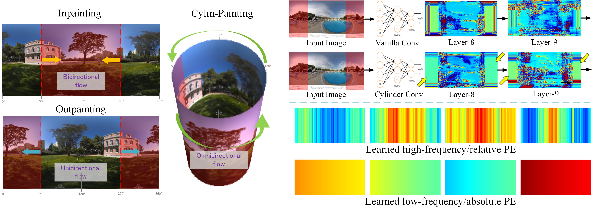
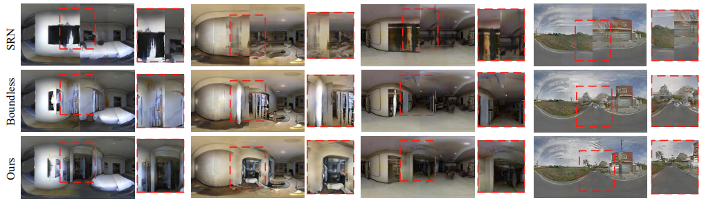

# Cylin-Painting: Seamless 360° Panoramic Image Outpainting and Beyond
## Introduction
This is the official implementation for [Cylin-Painting](https://arxiv.org/abs/2204.08563) (IEEE TIP 2024).

[Kang Liao](https://kangliao929.github.io/), [Xiangyu Xu](https://sites.google.com/view/xiangyuxu), [Chunyu Lin](http://faculty.bjtu.edu.cn/8549/), [Wenqi Ren](https://sites.google.com/view/wenqiren/homepage), [Yunchao Wei](https://weiyc.github.io/), [Yao Zhao](http://mepro.bjtu.edu.cn/zhaoyao/e_index.htm)

> ### Problem
> Given a fixed field of view (FoV) image, Cylin-Painting aims to extrapolate a 360° texturally seamless and semantically consistent panoramic image.
>  ### Features
>  * First effort to analyze the essential difference between image inpainting and image outpainting theoretically and experimentally
>  * Efficiently fuse the different spatial arrangements of the input image, which also enables a seamless 360° panoramic image extrapolation
>  * Make an early attempt to systematically describe the strengths and limitations of positional encoding in CNNs. Furthermore, we tame the cylinder convolution with a novel learnable positional encoding, which essentially improves the generation results
>  * Our method can serve as a plug-and-play module and can flexibly extend to other 360° panoramic vision tasks including low-level tasks and high-level tasks


**<div align="center">We propose a new Cylin-Painting to effectively combine the advantages of image inpainting and image outpainting.</div>**

## Installation
Using the virtual environment (conda) to run the code is recommended.
```
conda create -n cylin_painting python=3.6
conda activate cylin_painting
pip install -r requirements.txt
```
## Dataset
We explored the panoramic image outpainting tasks on three panoramic image datasets: SUN360 [1], Matterport3D [2], and 360SP [3], including the indoor and outdoor scenes. For each dataset, we consider the image outpainting case with the resolution of 256 × 256 → 512 × 256.

## Pretrained Model
Download the pretrained model [here]() and put it into the ```.\checkpoint``` folder.

## Training
Customize the paths of training datasets and saving checkpoints, GPU id, and run:
```
sh scripts/train.sh
```
## Testing
Customize the paths of checkpoint and test set, and run:
```
sh scripts/test.sh
```


**<div align="center">Our method can reach a seamless and semantically plausible transition of the generated content between two image boundaries.</div>**


## Reference
```
[1] Xiao, J., Ehinger, K.A., Oliva, A. and Torralba, A., 2012, June. Recognizing scene viewpoint using panoramic place representation. In 2012 IEEE Conference on Computer Vision and Pattern Recognition.
[2] Chang, A., Dai, A., Funkhouser, T., Halber, M., Niessner, M., Savva, M., Song, S., Zeng, A. and Zhang, Y., 2017. Matterport3d: Learning from rgb-d data in indoor environments. arXiv preprint arXiv:1709.06158.
[3] Chang, S.H., Chiu, C.Y., Chang, C.S., Chen, K.W., Yao, C.Y., Lee, R.R. and Chu, H.K., 2018. Generating 360 outdoor panorama dataset with reliable sun position estimation. In SIGGRAPH Asia 2018 Posters.
```


